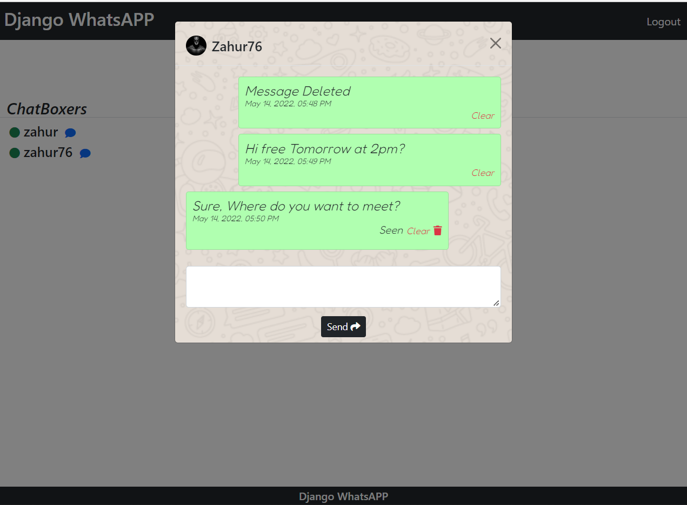
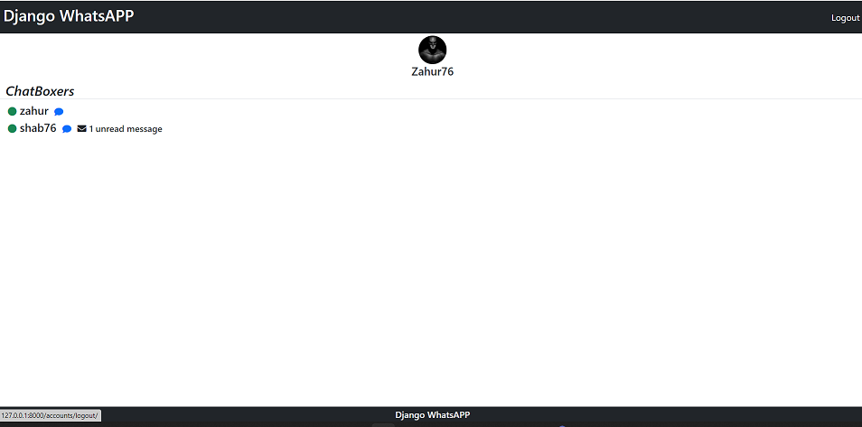

# Django WhatsApp

An App which allows messaging for signed in users. 

Works similar to whatsapp with seen and unseen status.





Live [site](http://mo-lacuizine.herokuapp.com/)

## INSTALLATION

* clone repo 
* run ```pip install -r requirements.txt```
* run ```python manage.py makemigrate```
* run ```python manage.py migrate```
* run ```python manage.py createsuperuser```
* run ```python manage.py runserver```


## TECHNOLOGIES USED

* HTML5
* css 
* javacript (ES6)
* python (v3.8.6)
* Django
* Django restframework to send messages to frontend via fetch request
* SQL database
* Jquery
* Chrome developers tools for analysing scripts and debugging
* Boostrap 5 for :
    1. page layout purposes and responsive design aspects
    2. Forms 
    3. Modals 


## Messages Deletion

Clear will erase message from logged-in user side only.

Delete will modify message to "Message Deleted" for both sender and receiver. This can only be done by the message creator

